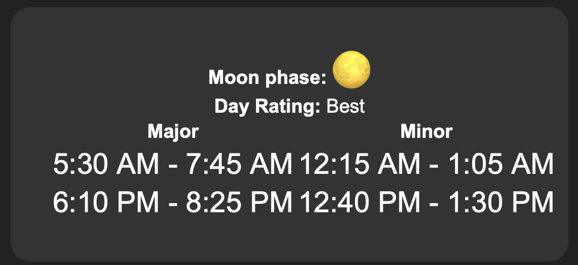

# MMM-Solunar
## Description
Solunar calendar module for MagicMirror.  It displays the current days moon phase, rating (for fishing/hunting), and optimal major and minor times.

Supports multiple APIs (no API key required):
- `metNo`: [MET Norway Sunrise API](https://api.met.no/weatherapi/sunrise/3.0/documentation)
- `solunarOrg`: [Solunar API](https://www.solunar.org/)
- `auto` (default): try `metNo` first, then fall back to `solunarOrg`

`metNo` data is mapped to Solunar-style output. Day rating is estimated from moon phase proximity to new/full moon.



## Installation
Goto `modules` directory in your MagicMirror install and:
```
$ git clone https://github.com/poolis/MMM-Solunar
```
## Configuration
Add block to config.js:
```
  ...
  {
    module: "MMM-Solunar",
    header: "Solunar info",
    config: {
        updateInterval: 60 * 60 * 1000, // 1 hour
        latitude: 40.7128, // Default: New York City
        longitude: -74.0060,// Default: New York City
        tz: -4, // Default: Eastern Daylight Time (EDT)
        apiProvider: "auto" // "auto", "metNo", or "solunarOrg"
    }
  }
  ...
```

## API Provider
Use `apiProvider` to select which backend API the module calls:

- `auto`: Try `metNo` first and automatically fall back to `solunarOrg` if request fails.
- `metNo`: Calls `api.met.no` and converts moon events into major/minor windows.
- `solunarOrg`: Uses the original solunar.org response directly.
