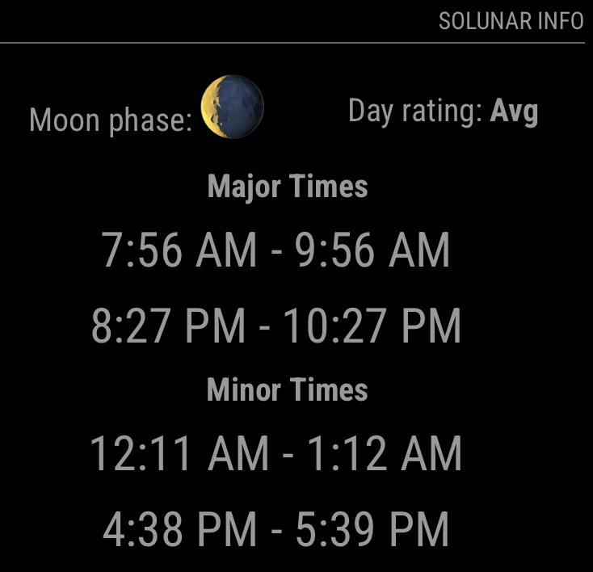

# MMM-Solunar
## Description
Solunar calendar module for MagicMirror.  It displays the current days moon phase, rating (for fishing/hunting), and optimal major and minor times.

Depends on [Solunar API](https://www.solunar.org/) but it does not require a key.



## Installation
Goto `modules` directory in your MagicMirror install and:
```
$ git clone https://github.com/poolis/MMM-Solunar
```
## Configuration
Add block to config.js:
```
  ...
  {
    module: "MMM-Solunar",
    header: "Solunar info",
    config: {
        updateInterval: 60 * 60 * 1000, // 1 hour
        latitude: 40.7128, // Default: New York City
        longitude: -74.0060,// Default: New York City
        tz: -4 // Default: Eastern Daylight Time (EDT)
    }
  }
  ...
```
